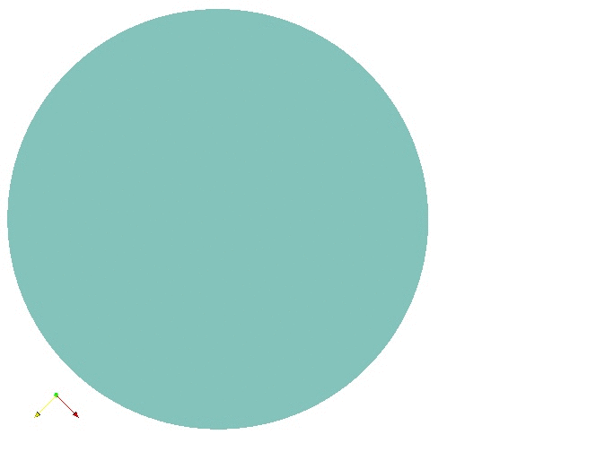

# C++ library for origami-based folding
This project aims to develop an automatic folding algorithm to fold a parachute.The folding algorihtm is based on "Zhonghua Xi, Jyh-Ming Lien, Folding Rigid Origami with Closure Constraint" and "Sarah-marie belcastro and Thomas C. Hull, A Mathematical Model for Non-Flat Origami". The following animation shows a simple test case of folding a round canopy.

